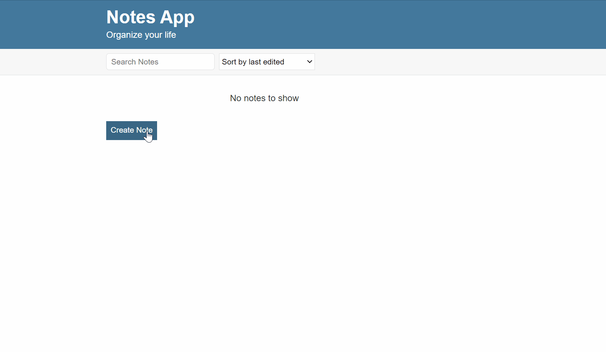
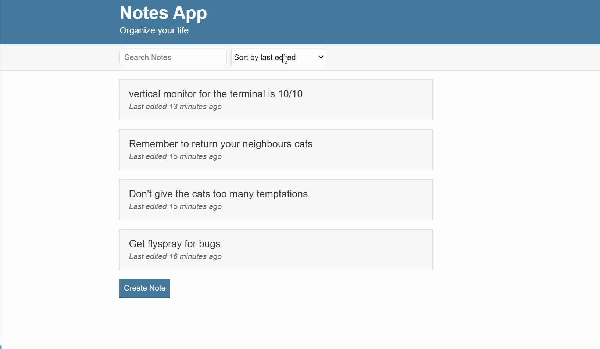

# Stop forgetting things  👀🐵

## A note taking application that features,
- 👊 Creating
- 👍 Reading
- 👌 Updating 
- 👉 Deleting 
- ✌️ SortBy Date created, Last edited, Alphabetical

---

# 💹 Motivation 

### This project was created to show a CRUD application using basic javascript. 

---

### 🔨 Built with

## Javascript & express

*Installation*
 - Clone Repo
 - NPM install
 - NPM RUN start

---

### Runs on: 
- localhost:3000
- nodemon

---

## 👉 Here is what the application looks like

## Example 1

--- 
## Example 2

---
